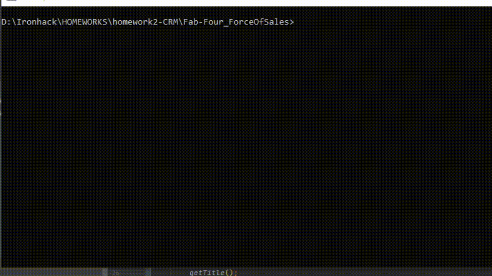

# Force Of Sales

## Table of Contents

1. [Introduction](#Introduction)
2. [Functionality](#Functionality)
    1. [Lead](#Lead)
    2. [Opportunity](#Opportunity)
    3. [Account](#Account)
3. [User Tutorial](#User-Tutorial)
4. [Class Diagram](#Class-Diagram)
5. [Use Case Diagram](#Use-Case-Diagram)
### Introduction

Force of Sales is a compact, modern **CRM** (Customer Relationship Management) system for tracking prospective and existing customers through the sales process.

Our current client is the LBL Trucking Company which sells fleets of Trucks to large companies all over the world.

### Functionality
#### 1. Lead
- Leads can be added to the CRM by typing the command **New Lead**
- A Lead contains all the contact information of the prospective buyer:
 name, phone number, email, and company name
- A list of all Leads’ ids and names can be displayed by typing **Show Leads**
- An individual Lead’s details can be displayed by typing **Lookup Lead {id}** (example: lookup lead 1)
#### 2. Opportunity
- A Lead can be converted to an Opportunity by typing **Convert {id}**(example: convert 3)
- Opportunity is composed of the Contact data from Lead and additional information concerning the type (*BOX*, *HYBRID*, *FLATBED*) 
  and quantity of the product the buyer is interested in
- Contact is set as the decisionMaker for the new Opportunity and its status set to *OPEN*
- The CRM can display the Opportunity's information and set its status by typing **Closed-lost {id}** or **Closed-win {id}**(example: closed-lost 7)
#### 3. Account
- Opportunities are associated with Accounts
- Opportunities form a part of the Account which stores all the buyer's data, including details about their 
 company: industry type(*PRODUCE*, *ECOMMERCE*, *MANUFACTURING*, *MEDICAL*, *OTHER*), number of employees,
 city and country
### User Tutorial
- You can run the program by typing the command **run** in the terminal from the project directory 
- All the commands are case-insensitive
- The menu offers the **help** option which lists all the possible commands as well as the ability to quit 
 the program  

### Class Diagram 

### Use Case Diagram 

